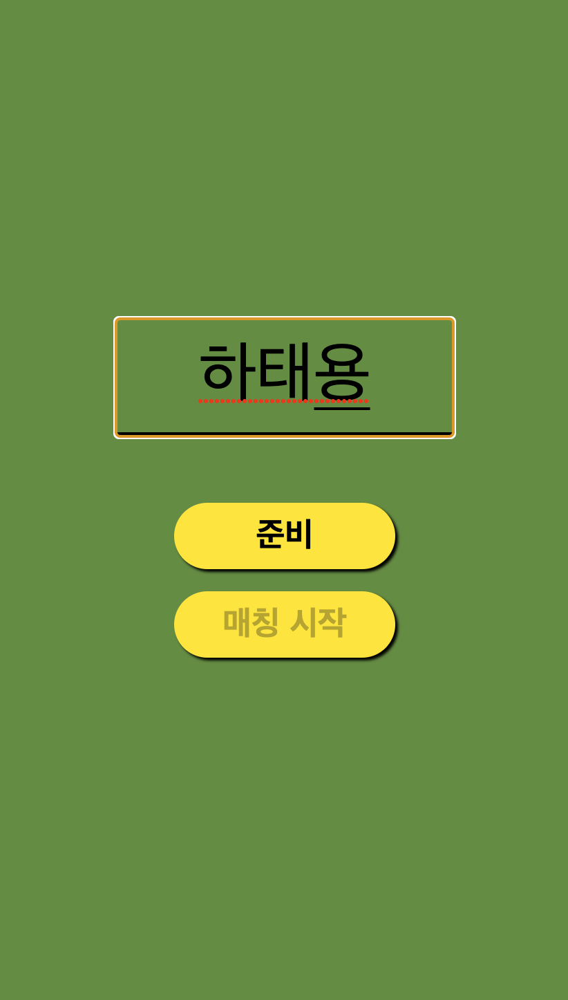
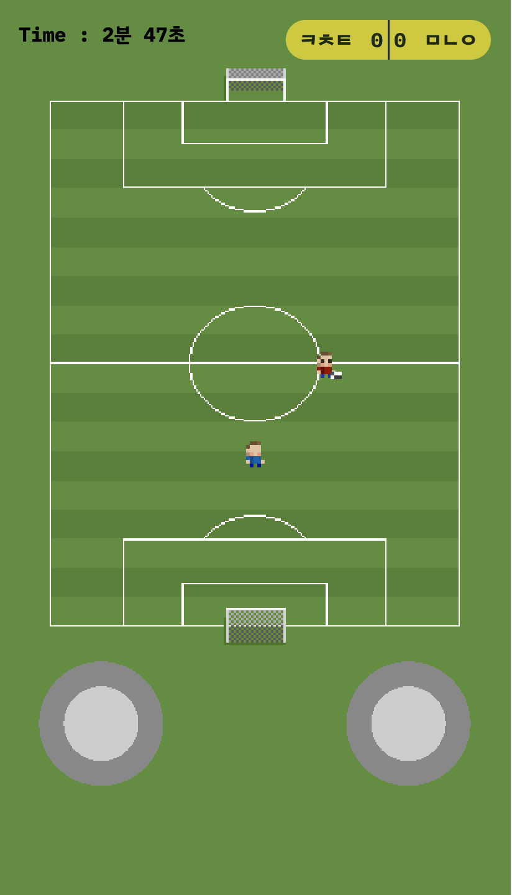

# 2D Football

https://2dfootball.online/

2D Football은 일대일 온라인 아케이드 축구 게임입니다.


<details>
  <summary>닉네임 설정 화면</summary>
  
</details>
<details>
  <summary>매칭 화면</summary>
  
</details>
<details>
  <summary>인게임 화면</summary>
  
</details>
<br>

## 호환 기기 및 브라우저

---

<br>

- 화면비 9:19.5의 동일한 모바일 기기 간 호환
- 크롬, 사파리 브라우저 호환

<br>

## 기획 동기

---

축구는 제가 가장 좋아하는 취미입니다. 축구와 관련된 좋은 추억이 있는 만큼, 이번
기회에 축구와 관련된 프로젝트를 하고 싶었습니다.

축구 규칙을 몰라도 쉽고 친근하게 다가갈 수 있도록 간단한 조작과 함께 아기자기한
캐릭터로 축구에 관심이 없던 사람들도 재미있게 플레이할 수 있는 게임을 구상하게되
었습니다.

Socket.io를 활용하여 실시간으로 오브젝트의 위치 및 상태 변화를 전달하는 실시간게
임을 꼭 구현해보고 싶었습니다.

## 기술 스택

---

### 프론트엔드

- JavaScript
- React
- Redux
- Redux-toolkit
- Phaser
- Socket.io-client
- styled-component

### 백엔드

- Node
- Express
- JavaScript
- Socket.io

## 프로젝트 기간

---

- **기획** : 2022/02/21 ~ 2022/02/27 (1주)
  - **1주차** : 아이디어 기획, mock up 제작, 기술스택 검증 및 개발 계획수립
- **개발** : 2020/02/28 ~ 2022/03/13 (2주)
  - **2주차** : 기능구현
  - **3주차** : 리팩토링, 테스트 코드, 리드미, 배포

## 주요 기능

---

1. 닉네임 작성 후 매치시작 버튼을 누르면 버튼을 누른 또 다른 사용자와 랜덤 매칭
   하여 경기할 수 있습니다.
2. 가상 조이스틱과 버튼을 활용해 슛, 달리기, 기본 이동을 할 수 있습니다.
3. 상대와 2분 동안 실시간으로 대전할 수 있습니다.

## installation

---

### Client

```
$ git clone https://github.com/hatae94/2D-Football-frontend.git
$ cd 2D-Football-frontend

$ npm install
$ npm start
```

### Server

```
$ git clone https://github.com/hatae94/2D-Football-backend.git
$ cd 2D-Football-backend

$ npm install
$ npm run dev
```

## About Tech Stack

---

### Phaser

웹앱 형식의 게임을 만들기에 앞서, 웹 기반의 게임을 구현하는 데에 최적화된
Canvas, Webgl 렌더러를 사용하는 게임 프레임 워크로 Phaser를 선택하게 되었습니다.

Phaser는 클래스 기반의 객체 지향 언어를 지원합니다. 이에 따라 클래스 문법에 익숙
하지 않은 저에게 객체 지향 언어에 대한 이해의 폭을 넓히는 좋은 기회였다고 생각합
니다.

## Deploy

---

### Client

netlify를 사용하여 배포하였습니다.

### Server

AWS Elastic beanstalk을 사용하여 배포하였습니다.

## Comments

---

### Phaser

- isometric 방식이 아닌 image와 spriteSheet를 사용하여 오브젝트를 생성하였습니다
  .
- 축구 게임와 같은 동적인 게임 구현의 경우 끊임없이 오브젝트의 위치가 변화하며,
  이는 렌더링 지연으로 이어져 사용자 경험이 크게 떨어질 수 있겠다는 판단이 들었
  습니다.
- 이러한 문제점을 해소하기 위해 위해 플레이어, 공 오브젝트들의 초기 위치 값을 지
  정하여 조건문을 넣었고, 과도한 렌더링을 어느정도 방지할 수 있게 되었습니다.
- 이러한 경험과 함께 실시간으로 끊임없이 데이터를 주고받는 게임에서는
  client-server 아키텍처를 철저히 설계해야한다는 교훈을 얻었습니다.

## 느낀 점

---

- 저는 축구를 하는 것, 보는 것, 게임 모두 좋아합니다. 이번 기회에 축구 플래시 게
  임을 개발하면서 취미 생활과 개발적 성장을 모두 할 수 있었던 것 같아 정말 즐거
  웠습니다.

- 클래스 문법에 대해 이해가 부족했던 저에게 클래스 문법 기반의 객체 지향 언어를
  지원하는 Phaser 게임 프레임워크는 익숙치 않는 난관의 연속이었습니다. 하지만 이
  런 경험을 통해 새로운 시야가 열리는 느낌이 들었고, 객체 지향 언어에 대한 이해
  도를 높일 수 있는 좋은 경험이었다고 생각합니다.

- socket.io를 활용한 실시간 통신과 동적인 게임의 조합으로 렌더링 지연이라는 이슈
  가 나타나 힘들었지만, 렌더링 지연 보상과 같은 client-server 아키텍처 설계의 중
  요성에 대해서 느낄 수 있었습니다. 기회가 된다면 client-server 아키텍처를 활용
  하여 더욱 효율적인 실시간 온라인 게임을 만들어보고 싶습니다.

- 기기의 종류마다 다른 화면 비율로 인해 발생하는 오브젝트의 크기와 위치 차이를전
  체 화면을 분할하고 임의의 구역을 정의하여 Grid를 만듦으로써 화면을 벗어나지않
  고 일정한 비율을 가질 수 있도록 구현할 수 있었습니다. 하지만 기기의 종류마다서
  로 다른 해상도 차이에 따른 두 기기 간의 오브젝트 위치 공유가 최적화 되지 못하
  여 호환성의 한계를 가지는 점이 아쉬움으로 남습니다. 기회가 된다면 pixel ratio
  를 활용하여 오브젝트의 스케일을 일관성 있게 세팅해보고 싶습니다.
